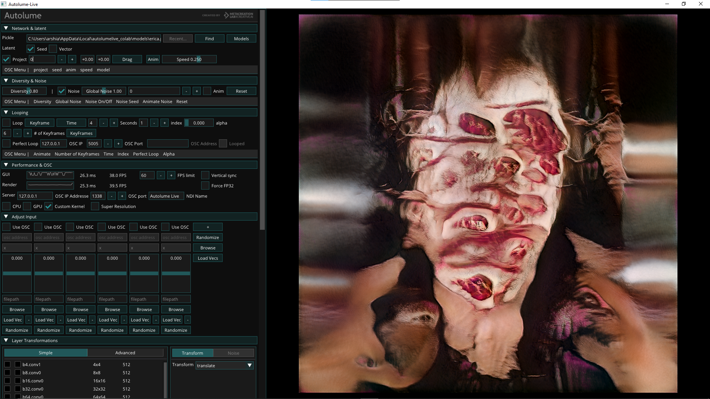
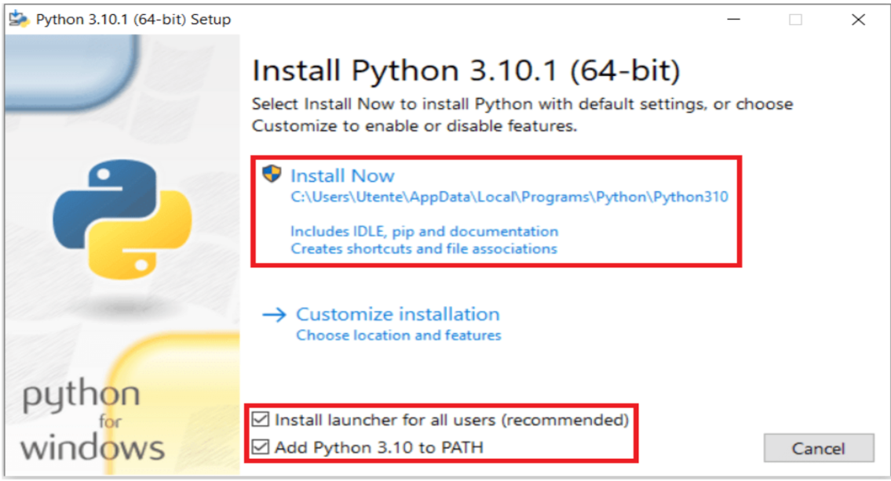

# Autolume

Autolume-Live is a tool for real-time visual performances using StyleGAN2.

For detailed documentation and demos look at the [Metacreation Lab Website](https://www.metacreation.net/autolume).



## Getting started
### Ubuntu Autolume Installer Guide
To successfully run this program, your system must have a 64-bit Linux operating system, and you must download and install the following prerequisites:
- [Python 3.10](https://www.python.org/downloads/)
- [Git](https://git-scm.com/)

#### Installation Steps

1. Open a terminal.
2. Clone this repository using the following command:
   ```bash
   git clone git@github.com:Metacreation-Lab/autolume.git
   ```
3. `cd` into the cloned repository
4. Run the installer with `sh installer.sh`

#### Adding ffmpeg

1. Update and upgrade the system packages to get the ffmpeg version currently available in the repository. Execute the following command:
   ```bash
   sudo apt update && sudo apt upgrade
   ```
2. After upgrading the repository, install ffmpeg by running the following command:
   ```bash
   sudo apt install ffmpeg
   ```
3. Confirm that ffmpeg has been installed with:
   ```bash
   ffmpeg -version
   ```

### Windows Autolume Installer Guide

To successfully run this program, your system must have a 64-bit Windows (Windows 10 & 11 compatible) operating system, and you must download and install the following prerequisites:

- **[Autolume Installer](sinstaller.ps1)** (download this file)
- **[Cuda-Toolkit](https://developer.nvidia.com/cuda-11-7-0-download-archive)**
- **[Python 3.10](https://www.python.org/downloads/release/python-3100/)** (scroll down to files and select a compatible version to your system)

*While installing Python, make sure to select "Add Python to PATH" as shown below:*



#### Installation Steps

1. Open Command Prompt (`windows+R` > `cmd`)
2. Run the following command: `where python`
   - Ctrl+C the result. It should look like this:
     ```
     C:\Users\Metacreation Lab>where python
     C:\Users\Metacreation Lab\AppData\Local\Programs\Python\Python310\python.exe
     C:\Users\Metacreation Lab\AppData\Local\Microsoft\WindowsApps\python.exe
     ```
   - If more than one result is thrown, copy Python 3.10.

3. Click on the `sinstaller.ps1` file and open it (located in your Downloads folder).
4. Paste the outcome of step 2 to the `systemPython` variable under `#Define python path` in the script:
   ```powershell
   # Define python path
   $systemPython = "C:\Users\Metacreation Lab\AppData\Local\Programs\Python\Python310\python.exe"
   ```

5. If this is the first time running a script in Windows, you have to enable that functionality first. Detailed instructions to do so, can be found **[here](https://medium.com/@dfarkhod/how-to-enable-powershell-script-execution-in-windows-10-49f2b182649d)**

6. Go to Downloads and type PowerShell in the address bar and hit Enter.
7. Run the following command inside PowerShell: `.\sinstaller.ps1`
8. Next time you want to run Autolume, simply click the AutolumeLiveColab shortcut on your Desktop.

Place your StyleGAN2 checkpoints (https://github.com/NVlabs/stylegan2-ada-pytorch) in the `models` folder.
Click the AutolumeLiveColab desktop shortcut and get going!

## Examples

Showcase of current state: https://www.dropbox.com/s/e8yfdtdw3x3s7h0/autolume.mp4?dl=0 \
Trial runs:\
    https://www.instagram.com/p/ChsrxkCjJNu/ \
    https://www.instagram.com/p/Cg5aMrqjgIM/ \
Artworks: \
    https://metacreation.net/autolume-mzton/ \
    https://www.metacreation.net/projects/dreamscape/ \
    https://metacreation.net/autolume-acedia/ 

## Credits
Philippe Pasquier: Director of Metacreation Lab for Creative AI, Principal Investigator \
Arshia Sobhan: Project management \
Jonas Kraasch: Project first-phase development \
Arthur Deleu: Project development \
Mahshid Jabari: DevOps \
Peter Chen: Contributions to the super-resolution module \
Manuel Bolduc: User testing \
Ahmed Abuzuraiq: Research associate

## Acknowledgment
PyTorch StyleGAN2-ada: https://github.com/NVlabs/stylegan2-ada-pytorch \
Underlying GUI code: https://github.com/NVlabs/stylegan3 \
GAN compression: https://github.com/lychenyoko/content-aware-gan-compression \
GANSpace: https://github.com/harskish/ganspace

## License
Some of the dependencies fall under the [Nvidia Source Code License](https://github.com/NVlabs/stylegan2-ada-pytorch/blob/main/LICENSE.txt).

## Project status
This code base is still open to changes and bugs might still appear. Please create issues and let us know so we can polish it for the final release! \
As a dedicated research team behind Autolume, we emphasize that our system is a tool for exploration and innovation without direct support.
