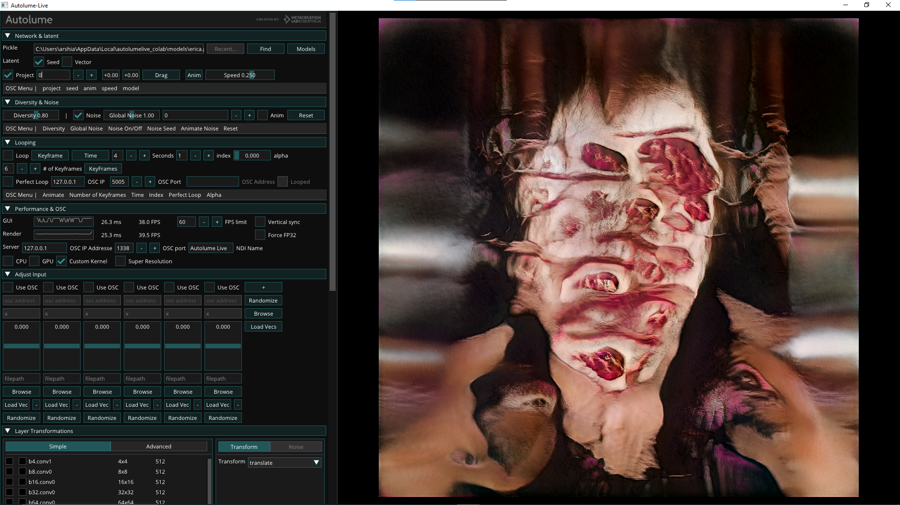

# Autolume

Autolume-Live is a tool for real-time visual performances using StyleGAN.

For detailed documentation and demos look at the [Metacreation Lab Website](https://www.metacreation.net/autolume).



## Downloads

Latest release:
- [Autolume 2.16.2 for Windows](https://1sfu-my.sharepoint.com/:u:/g/personal/lringenb_sfu_ca/IQCoCAMiIz-BS6Rlvyu7aza8ATVbAzL-Hue0F1uXoNxHt-I?e=JF5bOq)

## Examples

For examples of artworks created with Autolume see: https://www.metacreation.net/artworks

## Development instructions

### Dependencies

- [uv](https://docs.astral.sh/uv/#installation)
- CUDA 12.8 ([download link](https://developer.nvidia.com/cuda-12-8-0-download-archive)) — Windows/Linux with an NVIDIA GPU
  - Minimum components: CUDA Development + CUDA Runtime

System dependencies are installed per platform with the OS package manager:

#### Windows

- Microsoft C++ Build Tools ([download link](https://download.visualstudio.microsoft.com/download/pr/13907dbe-8bb3-4cfe-b0ae-147e70f8b2f3/a3193e6e6135ef7f598d6a9e429b010d77260dba33dddbee343a47494b5335a3/vs_BuildTools.exe))
  - Minimum components: Desktop development with C++

FFmpeg:

```bash
winget install Gyan.FFmpeg
```

#### Linux (Ubuntu 24.04)

```bash
sudo apt install portaudio19-dev ffmpeg
```

#### macOS

```bash
brew install portaudio ffmpeg
```

`imgui` and `pyaudio` have no Apple Silicon wheels and build from source, so also install the Xcode Command Line Tools with `xcode-select --install`.

### Initial setup

Create the Python environment:

```bash
uv sync
```

#### Download pre-trained models

Download pre-trained models from [Real-ESRGAN](https://github.com/xinntao/Real-ESRGAN) and [face-parsing.PyTorch](https://github.com/zllrunning/face-parsing.PyTorch):

```bash
curl -L 'https://github.com/xinntao/Real-ESRGAN/releases/download/v0.1.0/RealESRGAN_x4plus.pth' -o 'sr_models/Quality.pth'
curl -L 'https://github.com/xinntao/Real-ESRGAN/releases/download/v0.2.5.0/realesr-general-x4v3.pth' -o 'sr_models/Balance.pth'
mkdir -p training/distillation/Util/face_parsing/pretrained_model
curl -L 'https://drive.google.com/uc?export=download&id=154JgKpzCPW82qINcVieuPH3fZ2e0P812' -o 'training/distillation/Util/face_parsing/pretrained_model/79999_iter.pth'
```

### Running the program

Start the program
```bash
uv run main.py
```

### Create a release

Run the cross-platform release script on the OS you want to build for (PyInstaller
cannot cross-compile — a Windows build must run on Windows, etc.):
```bash
uv run release.py
```

ffmpeg/ffprobe are downloaded and bundled into the release automatically via
`ffmpeg-downloader`.

- **Windows / Linux:** output is the `dist/Autolume/` folder.
- **macOS:** output is `dist/Autolume.app`. It is unsigned, so the first launch
  needs right-click → Open (or notarize it yourself). The build uses
  `assets/metacreation-logo.icns`.

### Building documentation

```bash
uv run zensical build
```

The documentation will be output to `site`.

To serve the documentation locally:

```bash
uv run zensical serve
```

The documentation will be served at `http://127.0.0.1:8000/`.

## Credits

- Philippe Pasquier: Director of Metacreation Lab for Creative AI, Principal Investigator 
- Arshia Sobhan: Project management
- Lionel Ringenbach: Software development
- Michael Tjokrowardojo: Software development
- Jonas Kraasch: Project first-phase development
- Arthur Deleu: Project development
- Mahshid Jabari: DevOps
- Peter Chen: Contributions to the super-resolution module
- Manuel Bolduc: User testing
- Ahmed Abuzuraiq: Research associate

## Acknowledgment

StyleGAN3: https://github.com/NVlabs/stylegan3

GAN compression: https://github.com/lychenyoko/content-aware-gan-compression

GANSpace: https://github.com/harskish/ganspace

## License

Some of the dependencies fall under the [Nvidia Source Code License](https://github.com/NVlabs/stylegan2-ada-pytorch/blob/main/LICENSE.txt).

## Project status

This code base is still open to changes and bugs might still appear. Please create issues and let us know so we can polish it for the final release!

As a dedicated research team behind Autolume, we emphasize that our system is a tool for exploration and innovation without direct support.
