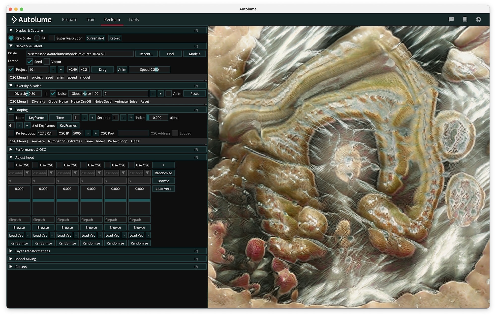

# Getting Started

Autolume is a no-coding generative AI system allowing artists to train, craft, and explore their own models.

Explore features and published artworks on the [Autolume website](https://www.metacreation.net/autolume).

## Supported platforms

Autolume is supported on Windows 10+, Ubuntu 24+, and macOS 14+ on Apple Silicon.

For best performance, a Nvidia GPU is required (RTX 2070 or higher recommended).

### Apple Silicon limitations (macOS / MPS)

Training a model on macOS is expected to be extremely slow and impractical for any resolution above 64x64.

StyleGAN3 models are not supported on macOS as they perform too poorly on this platform.

## Installation

[➡️ Download for Windows, macOS and Linux](https://github.com/Metacreation-Lab/autolume/releases/latest)

### Brew (macOS)

Add and trust the brew tap (one time)

```
brew tap metacreation-lab/tap
brew trust metacreation-lab/tap
```

Install the app

```
brew install --cask autolume
```

Update the app

```
brew upgrade --cask autolume
```

## Interface overview



Autolume opens on the **Perform** screen after the startup splash. The navbar at the top of the window gives access to the four screens at any time:

- **[Prepare](prepare.md)** — import images and videos and turn them into a training dataset.
- **[Train](train/index.md)** — train a model on a prepared dataset, from scratch or resuming from a checkpoint.
- **[Perform](perform.md)** — load a model and play with it live, in real time.
- **[Tools](tools.md)** — Projection, Super Resolution, and Model Mixing.

On the right side of the navbar, the cog icon opens **Settings** and the book icon opens this documentation. While a training run is active, navigation is locked to the Train screen until training finishes or is stopped.

## Where Autolume stores your data

Autolume keeps everything you generate or download — models, presets, captures, features, training runs, and datasets — in a single **data folder**. By default this is `~/autolume` (i.e. `autolume/` inside your user home folder).

The preferences file that records your data folder lives at `~/.config/autolume/config.json`.

Open **Settings** (the cog icon in the navbar) to point Autolume at a different folder, open it in your file manager, or reset it to the default.