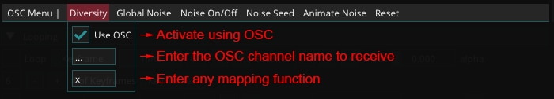
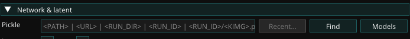
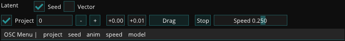
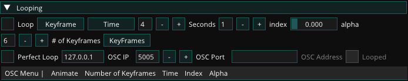
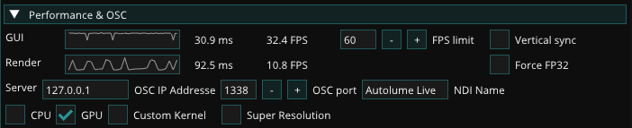
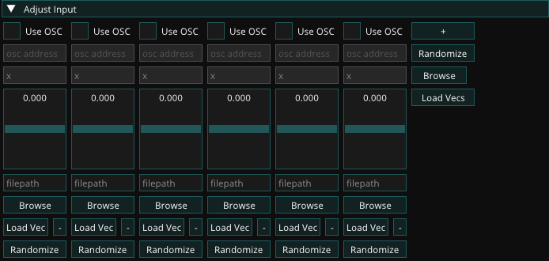
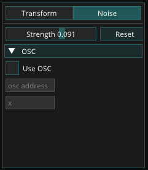
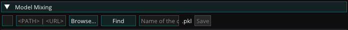
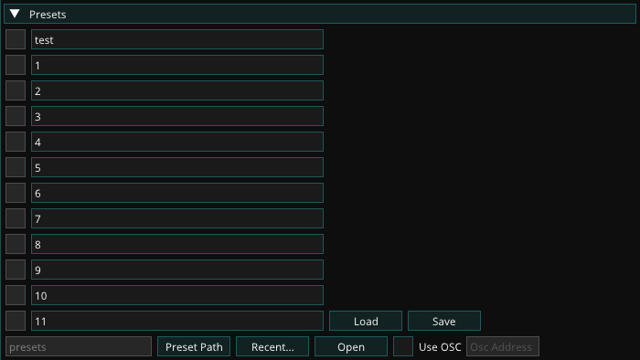

# Live Module

Autolume Live is the module in which you can load a model and work with it in real time. It provides you with a diverse set of features to explore the latent space in different ways and to play with the parameters of the network. It also enables you to control the parameters via OSC protocol for audio-reactive and other kinds of interactive works.

## OSC

Autolume-live allows users to control parameters using its interface but also provides the option to control parameters using [OSC](https://www.google.com/url?q=https://ccrma.stanford.edu/groups/osc/index.html&sa=D&source=editors&ust=1769724592307780&usg=AOvVaw0M9rZhdAGtobHhNvfkNj2x). This allows you to control parameters in Autolume-live using other software, such as TouchDesigner, Max/MSP, or Processing. The OSC interface is available for all parameters in the real-time interface. Most widgets have an OSC menu similar to the following:

It displays the different parameters that can be controlled using OSC. By clicking on a parameter name, a popup opens which allows you to check the box Use OSC to activate the OSC control for that parameter. In the next field, you can provide the OSC channel name. The last field is a mapping function that can be used to perform post-processing on the control signal to make sure that the right data range is used. This follows the math format defined by Python.

Please see [Performance and OSC](#performance-and-osc) about how to set the OSC IP Address and port in the software you use to send the OSC signals.

## Network and Latent

This widget allows you to load models and explore their latent space, i.e. the images it can generate.

### Model Loading

Use Find to navigate to the location of a .pkl file or press Models to open a list of models in your models folder inside your autolumelive_colab directory (the installation directory). You can copy any .pkl file there for quick access inside Autolume-live.

Loading a model for the first time can take a few seconds as we test if the computer is capable of running custom CUDA code that improves the performance. Afterward, models are stored in cache and loading should be much faster.

- Recent: Shows the most recently loaded models.
- Find: Opens a file browser to find a model.
- Models: Shows all models in the “models” folder.

### Latent Space

StyleGAN's latent space is a hyper-dimensional vector space where each point uniquely represents a potential image generated by the model. By changing and manipulating vectors in the latent space, it is possible to alter the characteristics of the generated images and continuously explore the space of possibilities. This widget allows you to explore this space. There are two ways of exploring the latent space:

1. Seed

In this mode, the latent space is controlled using seed numbers, each corresponding to a unique latent vector.

- Project: StyleGAN has a feature that maps latent vectors into a more desirable space. By toggling this off, you might receive less consistent results.
- Seed: The seed is a number that is used to generate a latent vector. By changing the seed you can explore different points in the latent space.
- Drag: By dragging after clicking the button you can explore the latent space. This incrementally changes the seed.
- Anim/Stop: Starts/stops animating a continuous movement in the latent space.
- Speed: Controls the speed of the animation.

2. Vector

This mode corresponds to a more free exploration of the latent space, similar to a random walk, leading to a more fluid feeling when animating. Seed numbers are not available in this mode.

- Project: StyleGAN has a feature that maps latent vectors into a more desirable space. By toggling this off, you might receive less consistent results.
- Randomize: Randomizes the latent vector.
- Anim/Stop: Starts/stops animating a continuous movement in the latent space.
- Speed: Controls the speed of the animation.
- Save/Load Vector: You can save a specific latent vector and later load it to replicate the same result.

## Diversity and Noise

This widget allows users to manipulate the diversity of images that can be generated and the internal noise used by the model. The noise generally defines the texture of the image, while the diversity defines the overall look of the image.

- Diversity: The diversity of the image. This is a slider between 0 and 2 (but can be changed to any number through OSC). A value of 0 means that the model will generate the same image every time. Generally, a value between 0.8 and 1 is recommended for a wide range of images, that stay true to the original dataset.
- Noise: Toggle the noise on and off. This will give you a feel of which features the noise impacts. A rule of thumb is that when the noise is turned off, the resulting images will be smooth, without textures.
- Global Noise: This is a slider between 0 and 2 (but can be changed to any number through OSC) that controls the amount of noise that is applied to the entire image.
- Noise Seed: This is an integer that controls the seed of the noise. This allows you to change the noise without changing the diversity of the image. This is useful when you want to keep the same image but change the texture.
- Anim: Toggles noise animation, which changes the Noise Seed every frame.

## Looping

To generate seamless loops use this widget. It can either work based on specified keyframes or by "noise loop", creating a random loop based on a set radius. Each can be animated based on a specific time interval or by a speed value.

### Keyframe Looping

- \# of Keyframes: The number of keyframes used to generate the loop. The more keyframes, the more accurate the loop will be.
- Keyframes: This popup window controls the keyframes used to generate the loop. You can add keyframes by clicking the keyframe button which opens a popup.  
  
- Time: Controls the duration of the loops in seconds.
- Index: Controls the keyframe number in the loop.
- Alpha: A value between 0 and 1 that corresponds to the whole length of the loop.

### NoiseLoop Looping

- Time: Controls the duration of the loops in seconds.
- Looping Seed: Changes the start point of the loop.
- Radius: Controls how “large” the latent loop is. Larger values correspond to more diverse changes during the loop.
- Alpha: A value between 0 and 1 that corresponds to the whole length of the loop.

### Perfect Loop

The Perfect Loop option at the bottom of both looping options can help capture the perfect loop. Checking the box will send a 1 signal at the end of each loop cycle through OSC with the OSC IP, port, and address that you can specify.

## Performance and OSC

This widget provides information and settings about the real-time module’s performance, OSC connection IP address and port, and NDI name for sending visuals out.

The Render FPS shows the frame rate of the images being generated. The NDI Name can be used to receive the visuals in the software using the NDI protocol. The OSC information is to receive OSC signals in Autolume.

At the bottom of the widget, you check the box for CPU, if you want to run on CPU only. This will allow you to still run the real-time module, but will significantly reduce the frame rate of image generation (to around 1 fps, depending on your specific CPU). You can also choose the Custom Kernel option after a model is loaded to increase the performance and boost the rendering frame rate.

## Adjust Input

This widget allows you to move the latent vector in adjustable directions. By default, the sliders correspond to random directions, each controllable also through OSC. You can also use Browse (on the right) to load the vectors calculated from the [GANSpace](offline-modules.md#ganspace) module so that all the sliders correspond to the extracted features. It is also possible to load individual vectors for each slider or to randomize directions altogether or individually.

## Layer Transformations

Under the hood the generative model has layers. Each layer performs operations on different resolutions. With this widget, you can control the different layers. This allows you to create a wide range of effects.

You can either do so per resolution in the Simple mode:

Or per layer in the Advanced mode:

To select which layer you want to manipulate you press the second checkbox, with the pen at the respective resolution or layer. And instead of only showing the final image you can also display the different layers output by clicking the checkbox with the eye.

Per layer, you can either perform a transformation on the image or specify the strength of the noise. Which layers are actively manipulated is visible by the T and N icons. Some layers do not have any adjustable Noise, hence the noise tab is grayed out for those layers.

### Transformation

You can apply so-called affine transformations to the layers, such as rotation, scaling, and translation, These can be performed to all features, a random amount or a set range.

Each transformation's parameter can be controlled by an appropriate interface or by OSC.

### Noise

You can regulate the strength of the noise per layer.

## Model Mixing (real-time)

This widget allows you to perform model mixing like the offline module (see [Model Mixing](offline-modules.md#model-mixing)). When you switch layers a short latency might arise.

The first checkbox allows you to toggle if the mixed model should be used or not.

Following you can select a model either through the browse feature, by listing all models in the "models" folder. Or using the "Find" button to open a file browser.

Lastly, you can write a model name into the text field following the buttons. This allows you to quickly save the mixed model into the "models" folder.

After loading a second model you can mix the two models.

When mixing, you can choose to select features based on resolution or by layer. The latter option provides finer control, but the former option usually suffices. You can also remove features by pressing "X." This can be useful when one of the models generates images of higher resolution, and you want to align the resolution with the lower-resolution model.

## Presets

It is possible to save presets of the current state of all widgets and load them again. This allows you to quickly switch between different settings.

The checkboxes allow you to choose which preset you want to load or save to. If a checkbox is grayed out, it means nothing is saved to that preset.

At the bottom you can define the path where the presets are saved to and loaded from. Using the "Preset Path" opens a file browser to select a folder. While the "Recent" button opens a popup with the most recently used folders.

The OSC controls of this widget allow you to switch between presets in the current folder, by sending the name of the preset. Please note that you can rename your presets.