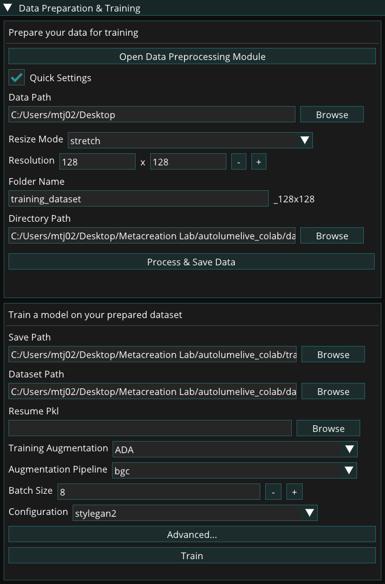
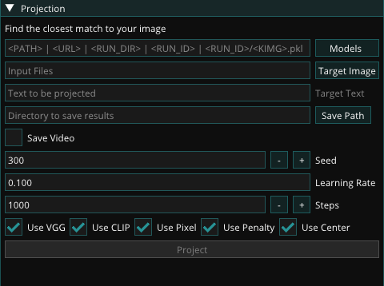
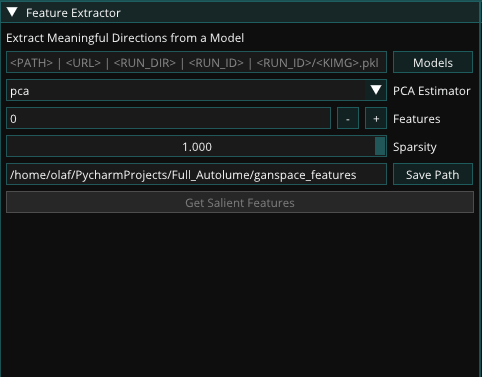
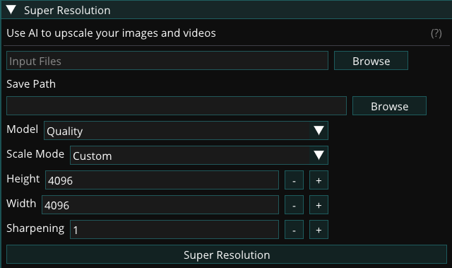
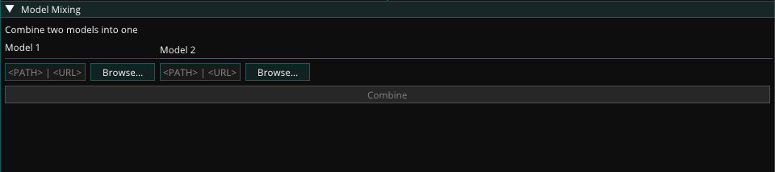

# Offline Modules

## Data Preparation 

This module provides options for dataset preparation prior to model training. The Data Preparation Module can be used for advanced configuration, while the Quick Settings feature allows faster dataset creation with basic parameters. It supports importing image and video files, formatting data into a consistent structure required for training. When a video file is imported, frames are automatically extracted based on the specified frame rate, converting motion footage into a sequence of still images suitable for training.

### Data Preparation Module 

The Data Preparation Module offers extended functionality and finer control over dataset creation. It includes options such as non-square framing to preserve image aspect ratios, image augmentations to expand dataset size and diversity, and integrated tools for managing and organizing data directly within the application. This module enables data to be imported, refined, and compiled entirely in-app. A built-in preview panel displays preprocessing results in real time, allowing visual verification of all applied changes before preprocessing and saving.

### Data Preparation Quick Settings

Unlike the full Data Preparation Module, the Quick Settings feature provides only the essential parameters needed for preparing data. It is designed for fast dataset creation and requires precompiled data, offering a simplified workflow for generating datasets quickly.

### Supported File Formats

The Data Preparation Module supports importing both image and video files. The following formats are supported:

Image formats:

- PNG (.png)
- JPEG (.jpg, .jpeg)
- BMP (.bmp)
- WebP (.webp)
- GIF (.gif)

Video formats:

- MP4 (.mp4)
- AVI (.avi)
- MOV (.mov)
- MKV (.mkv)
- WebM (.webm)
- GIF (.gif)

Data Preparation Process

To prepare a dataset, provide the following:

- Quick Settings:
  - Data Path: Specifies the source directory containing the image and video files. All supported media within this directory will be imported automatically.
- Resize Mode: Determines how images are resized during preprocessing. Options include stretch and center-crop.
- Resolution: Sets the target pixel dimensions (width × height) for all processed images using the + and – controls. Higher resolutions produce sharper outputs but require more GPU memory during training. It is recommended to test system limits before finalizing this setting.
- Folder Name: Defines the name of the output directory for the processed dataset. By default, the system appends a resolution suffix (e.g., dataset_1024x1024) to the folder name to indicate the dataset’s resolution size.
- Directory Path: Specifies the destination path where the processed dataset folder will be created.
- Data Preprocessing Module:
  - Non-square Framing: Enables image resizing while maintaining the original aspect ratio instead of forcing a square crop.
    - Aspect Ratio (Height & Width): Sets custom height and width proportions for non-square datasets.
    - Padding Mode: Determines how empty areas are filled when adjusting aspect ratios.
  - Augmentation: Applies augmentation techniques to the imported images during processing. These transformations are used to increase dataset size. It is important to select augmentation options carefully based on the nature of the data; for example, if the dataset contains orientation-sensitive subjects such as human faces, flip operations should be adjusted accordingly.

## Training 

The Training Module enables users to train models using datasets prepared through the Data Preparation Module. It supports both training from scratch and resuming from existing checkpoints. The module also leverages data augmentation during training to improve model stability and performance, particularly when working with smaller or less diverse datasets. Throughout the training process, checkpoints and image outputs are automatically generated to document progress and model development.

### Dataset 

The dataset size can range from fewer than a hundred to several thousand samples. A minimum of 50–200 samples is recommended, depending on the diversity and variability of the data. For optimal results, all images within a dataset must have the same dimensions, as a consistent image size is required for model training. Resizing can be performed manually or handled automatically within Autolume using the data preparation module.

### Training Augmentation

To facilitate training with smaller datasets, two augmentation methods are provided in Autolume: Adaptive Discriminator Augmentation (ADA) and Differentiable Augmentation for Data-Efficient GAN Training (DiffAug). These augmentation methods apply visual transformations to your data during training without modifying your original dataset to help the model continue learning effectively, even when limited data is available. Each method offers a set of pipelines, which are simply different combinations of these transformations applied dynamically during training.

While both methods serve the same purpose, they differ in how they apply these transformations. DiffAug uses fixed-strength, randomized augmentations in every training batch, introducing consistent variation. In contrast, ADA adjusts the strength of augmentations automatically based on how well the model is learning. It's recommended to experiment with both methods and their pipelines to find what works best for your dataset.

If training performance remains poor even after experimenting with augmentation methods and pipelines, consider increasing the size and diversity of your dataset. Additional data can significantly improve model stability and output quality. You may also use the Data Preparation Module’s augmentation features to expand your dataset before training.

For a detailed guide on choosing the right augmentation method and pipeline, refer to this document: [How to Select Augmentation Method and Pipeline](training-aug.md) 

For more technical details, please refer to:  
ADA: [https://github.com/NVlabs/stylegan2-ada-pytorch](https://www.google.com/url?q=https://github.com/NVlabs/stylegan2-ada-pytorch&sa=D&source=editors&ust=1769724592275861&usg=AOvVaw19KrbXZXtytksKuFDBKJa5)  
DiffAug: [https://github.com/mit-han-lab/data-efficient-gans](https://www.google.com/url?q=https://github.com/mit-han-lab/data-efficient-gans&sa=D&source=editors&ust=1769724592276125&usg=AOvVaw2Snhq4HaRpOS1Nc915Txjl)

### Training Process

To train a model, provide the following:

- Save Path: Choose the location where the training files will be saved.
- Dataset: Select the dataset on which the model will be trained. (See [Dataset](#dataset))
- Resume Pkl: Resume training from a previous training run or a pre-trained model by selecting a .pkl file. Skip this field if you are training the model from scratch.
- Training Augmentation: Select the style of augmentation to be applied during training. Experiment with different styles to find the one that works best for your data. (See [Training Augmentation](#training-augmentation))
- Augmentation Pipeline: Choose the types of augmentation to be performed. (See [Choosing Augmentation Pipeline](training-aug.md))
- Batch Size: Determine the number of images processed at once. This value is limited by the GPU memory available. A batch size of 8 is recommended for NVIDIA RTX 2070 GPU and above. Reduce to lower values (minimum 2) if memory issues arise.
- Configuration: Selects from a set of preset training configurations that serve as reliable starting points for different model resolutions. For example, the paper256 configuration is recommended when training models at 256×256 resolution. Refer to the Training New Networks section of [this link](https://www.google.com/url?q=https://github.com/NVlabs/stylegan2-ada-pytorch&sa=D&source=editors&ust=1769724592279946&usg=AOvVaw2lzyqjjDrZbdBs8gHhrKX4) for more details on the available configurations.

Advanced Options:

- Generator and Discriminator Learning Rates: Keeping the default value (0.002) is recommended for most cases. If changing all other hyperparameters does not lead to successful training, you can lower these values to 0.001.
- Gamma: Experiment with different gamma values if the default value (10) is not leading to successful training results. We recommend trying out at least a few different values of Gamma for each new dataset. Using increments of 10 is recommended.
- Number of ticks between snapshots: Specifies how often image snapshots and checkpoint files are generated during training. Each tick represents a defined training interval. Lower values produce snapshots more frequently, allowing closer monitoring of progress, but the visual changes between snapshots will be smaller. A setting between 1 and 4 is generally recommended for balanced tracking and performance.

After selecting the desired options, click the Train button to begin the training process. During training, the model periodically saves checkpoint (.pkl) files to the specified Save Path. A preview window displays a grid of randomly generated images from the model, corresponding to the latest image snapshot files saved in the fakesXXXXXX format (e.g., fakes000352) in the same directory.

Training can be stopped at any time by clicking the Cancel button in the preview window. The final model is saved as a .pkl file in the specified Save Path, and progress can be tracked through the series of generated image snapshots.

### Additional Resources

Please refer to these resources for more advanced discussions about hyperparameters for training.

[StyleGan Deep Dive](https://www.google.com/url?q=https://medium.com/@jules.padova/stylegan-deep-dive-from-its-architecture-to-how-to-make-synthetic-humans-e02c242a8b7d&sa=D&source=editors&ust=1769724592284434&usg=AOvVaw0FRJqPuzAS_TpFk0f-QqAN) 

Jules Padova

[Training configurations](https://www.google.com/url?q=https://github.com/NVlabs/stylegan3/blob/main/docs/configs.md%23training-configurations&sa=D&source=editors&ust=1769724592284799&usg=AOvVaw2ubjFQf_4b4gW-dlPtw8lh) 

Tero Karras & Janne Hellsten (NVIDIA Research)

### Alternative Training Options

While Autolume provides the necessary features for network training on a local machine, for more serious training sessions, users can use cloud-based alternative options to train a StyleGAN2 model on more powerful GPUs. The trained model (either using Tensorflow or PyTorch) can then be used in Autolume-live for real-time use or in other modules. A number of alternative options are as follows:

- Google Colab (simple, both free and paid options) 
   - [Colab notebook 1](https://www.google.com/url?q=https://colab.research.google.com/github/dvschultz/stylegan2-ada-pytorch/blob/main/SG2_ADA_PyTorch.ipynb&sa=D&source=editors&ust=1769724592286379&usg=AOvVaw06oiCjt41W8dzxXMYqWsaE)
  - [Colab notebook 2](https://www.google.com/url?q=https://colab.research.google.com/drive/1BBUxv6QO2hY4lTkCpeAPvSn7H50nTLSi?usp%3Dsharing%23scrollTo%3DNVTn49qEhR1L&sa=D&source=editors&ust=1769724592286630&usg=AOvVaw0pz4u0l394XyARv_kz5p6q)
- Paperspace (advanced, paid)
  - [How to Run StyleGAN2-ADA-PyTorch on Paperspace](https://www.google.com/url?q=https://blog.paperspace.com/how-to-set-up-stylegan2-ada-pytorch-on-paperspace/&sa=D&source=editors&ust=1769724592287066&usg=AOvVaw3u0tnlEOPRoepCoNOKbIck)

## Projection Module

The projection module allows loading a target image, a text prompt, or a combination of both,  to find the closest corresponding latent vector of a trained model. Different methods are provided to search for the corresponding latent vector that you can choose from. The output is the calculated vector plus a process video showing the search process.

The following options are available for the projection module:

- Models: Select the .pkl file of the model used for projection.
- Target Image: Choose a single image that should be found in the model.
- Target Text: Provide a description of an image that should be found in the model.
- Save Path: Specify the path where the closest match should be saved. The saved result includes the position in the model and the closest match.
- Save Video: Select this option to save a video of the process of finding the closest match.
- Seed: Select a seed to ensure consistent results for the closest match.
- Learning Rate: Adjust the learning rate of the projection to control convergence speed. Higher values result in faster projections but may be less accurate.
- Steps: Determine the number of steps for the projection. Higher values increase accuracy but require more time.
- Use VGG: Enable this option to use the VGG16 network for calculating image distance based on general features rather than pixel-by-pixel comparisons.
- Use CLIP: Enable this option to use the CLIP network for calculating image and text distance based on general features rather than pixel-by-pixel comparisons.
- Use Pixel: Enable this option to use pixel distance for image comparison. This puts more weight on pixel similarity between the match and the target.
- Use Penalty: Enable this option to penalize large update steps, resulting in a smoother projection and avoiding local minimums.
- Use Center: Enable this option to use an additional center crop as the target image. This can improve matching accuracy but may reduce overall accuracy.

## GANSpace

This module identifies and extracts interpretable feature directions in the latent space of a trained model based on Principal Component Analysis (PCA). These extracted feature directions can be then accessible in the Renderer (see [Adjust Input](live-module.md#adjust-input)).

The module provides the following options:

- Models: Select the .pkl file of the model for GANSpace exploration.
- PCA Estimator: Choose an algorithm to find salient directions in the latent space. Different algorithms result in slightly different extracted directions. Experiment with each option to find the best fit for your model.
- Features: Specify the number of features to extract. More features result in more adjustable directions in the real-time interface but also increase file size. Often, extracting around 10 features is recommended.
- Sparsity: This parameter adjusts the sparsity of the extracted directions. Leave it at the default if you are unsure about its impact.
- Save Path: Choose the path to save the GANSpace results, which include the extracted directions. These directions can be loaded in the "[Adjust Input](live-module.md#adjust-input)" widget in the real-time interface.

For more technical information on GANSpace, please refer to the following resources:

[GANSpace Paper](https://www.google.com/url?q=https://arxiv.org/abs/2004.02546&sa=D&source=editors&ust=1769724592296454&usg=AOvVaw1GSkgPNlwUg633Ht9d3zn6)

[GANSpace Repository on GitHub](https://www.google.com/url?q=https://github.com/harskish/ganspace&sa=D&source=editors&ust=1769724592296788&usg=AOvVaw3Xsw5-fahRCc_ZXrq6FtT5)

## Super-resolution

The Super-resolution module provides the feature to upscale images and videos for higher resolution distribution of your work. There are three different models available: Quality, Balance, and Fast. While the Processing speeds of the models differ, Quality being the slowest and Fast being the fastest, the slower models tend to preserve more details from the original image/video. However, the quality of the results also depends on the type of visual content and is better to be tested with all three models to find the desired option.

The following options are available:

- Input Files: Select the path to the images or videos that should be upscaled. Multiple files can be selected at once.
- Result Path: Specify the path where the upscaled images or videos should be saved.
- Model: Choose the upscaling model to be used: Fast, Balanced, or Quality. Fast is the quickest but provides lower quality, while Quality is the slowest but provides the highest quality.
- Scale Mode: Choose between defining the exact Height and Width of the output or using a Scale Factor. If the scale factor is selected, the height and width will be automatically calculated based on the scale factor.
- Sharpening: Adjust the sharpness of the upscaled image. Sharpening=1 means no added sharpness. Higher values result in sharper images but may introduce artifacts.

## Model Mixing

This module provides the ability to mix two trained models to make a new model. It works based on selecting parts of one model and parts of a different model, thereby mixing the features of the two models.

To mix two models, specify the following:

- Model 1: Select the .pkl file of the first model to be mixed.
- Model 2: Select the .pkl file of the second model to be mixed.

After pressing "Combine," you can select the layers to be used from each model. The layers are listed in order, from early to late layers. While lower-resolution layers (e.g. 4x4, 8x8, 16x16) correspond to coarse and higher-level features, higher-resolution layers correspond to fine features and textures. This can be used to determine what type of features the mixed model inherits from each source. Each layer can also be expanded to select detailed components for advanced mixing. Additionally, features can be removed from the mix. This can be useful when one of the models generates images of higher resolution, and you want to align the resolution with the lower-resolution model.

Finally, you have the option to save the mixed model as a new .pkl file, which can be used anywhere in Autolume.

For real-time model mixing in the Renderer, see [Model Mixing (real-time)](live-module.md#model-mixing-real-time).