# Perform

The Perform screen is where you load a model and work with it in real time. It is the screen Autolume opens on after startup. It provides you with a diverse set of features to explore the latent space in different ways and to play with the parameters of the network. It also enables you to control the parameters via OSC protocol for interactive works.

## Display and Capture

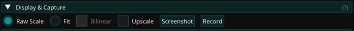

This widget controls how the visuals are displayed and lets you capture them.

- Raw Scale: Shows the visuals at their native size.
- Fit: Scales the visuals to fill the preview area.
- Bilinear: Smooths the visuals when they are scaled. It is only available when Fit is selected and is off by default, so the visuals stay pixel exact. Display scaling never affects screenshots and recordings, which always capture the visuals at their native size.
- Upscale: Runs an AI model on the rendered frames for a 4x larger output. It is off by default and has no cost while unchecked. The model weights are downloaded when a model is selected, so the first use needs an internet connection.
  - Model: Fast (4xLSDIRCompactC3) is the default and keeps the frame rate high. Standard (4xNomosWebPhoto_RealPLKSR) is the same model as in [Prepare](prepare.md) and gives the best quality. It needs a fast GPU and runs at a few frames per second on Apple Silicon.
- Fullscreen: Shows the visuals in full screen on the main display. Press Exit Fullscreen to return. This button is not available on macOS.
- Screenshot: Saves a snapshot of the visuals as an image in the captures folder (under your [data folder](index.md#where-autolume-stores-your-data), `~/autolume/captures` by default).
- Record: Records the visuals as a video in the captures folder. The button turns into a red Stop button while recording.

## Network and Latent

This widget allows you to load models and explore their latent space, i.e. the images it can generate.

### Model Loading

Press Browse to open your file browser and pick a .pkl file from anywhere on your computer, or press Models to open a dropdown of the models Autolume already knows about. You can also type or paste a path directly into the field and press Enter.

Loading a model for the first time can take a few seconds as we test if the computer is capable of running custom CUDA code that improves the performance. Afterward, models are stored in cache and loading should be much faster.

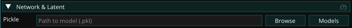

The Models dropdown contains:

- Your models folder: All .pkl files in your models folder (under your [data folder](index.md#where-autolume-stores-your-data), `~/autolume/models` by default). You can copy any .pkl file there for quick access inside Autolume.
- Your training runs: One submenu per training run, listing the snapshots it produced, so the models you trained yourself are available without looking them up on disk.
- Download Models...: The entry at the bottom, which opens a catalog of curated pre-trained models, with each model’s author and license listed. Press Download next to a model to download it into the “models” folder; a progress popup with a Cancel button is shown while it downloads, and the model appears under Models once finished. Models you already have are marked as Downloaded.

### Latent Space

StyleGAN's latent space is a hyper-dimensional vector space where each point uniquely represents a potential image generated by the model. By changing and manipulating vectors in the latent space, it is possible to alter the characteristics of the generated images and continuously explore the space of possibilities. This widget allows you to explore this space. There are two ways of exploring the latent space:

1. Seed

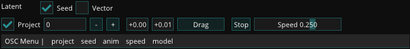

In this mode, the latent space is controlled using seed numbers, each corresponding to a unique latent vector.

- Project: StyleGAN has a feature that maps latent vectors into a more desirable space. By toggling this off, you might receive less consistent results.
- Seed: The seed is a number that is used to generate a latent vector. By changing the seed you can explore different points in the latent space.
- Drag: By dragging after clicking the button you can explore the latent space. This incrementally changes the seed.
- Anim/Stop: Starts/stops animating a continuous movement in the latent space.
- Speed: Controls the speed of the animation.

2. Vector

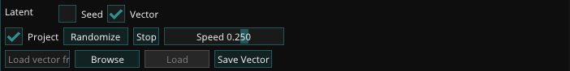

This mode corresponds to a more free exploration of the latent space, similar to a random walk, leading to a more fluid feeling when animating. Seed numbers are not available in this mode.

- Project: StyleGAN has a feature that maps latent vectors into a more desirable space. By toggling this off, you might receive less consistent results.
- Randomize: Randomizes the latent vector.
- Anim/Stop: Starts/stops animating a continuous movement in the latent space.
- Speed: Controls the speed of the animation.
- Save/Load Vector: You can save a specific latent vector and later load it to replicate the same result.

## Diversity and Noise

This widget allows users to manipulate the diversity of images that can be generated and the internal noise used by the model. The noise generally defines the texture of the image, while the diversity defines the overall look of the image.

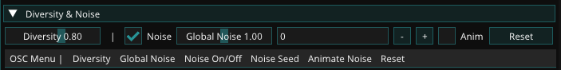

- Diversity: The diversity of the image. This is a slider between 0 and 2 (but can be changed to any number through OSC). A value of 0 means that the model will generate the same image every time. Generally, a value between 0.8 and 1 is recommended for a wide range of images, that stay true to the original dataset.
- Noise: Toggle the noise on and off. This will give you a feel of which features the noise impacts. A rule of thumb is that when the noise is turned off, the resulting images will be smooth, without textures.
- Global Noise: This is a slider between 0 and 2 (but can be changed to any number through OSC) that controls the amount of noise that is applied to the entire image.
- Noise Seed: This is an integer that controls the seed of the noise. This allows you to change the noise without changing the diversity of the image. This is useful when you want to keep the same image but change the texture.
- Anim: Toggles noise animation, which changes the Noise Seed every frame.

## Looping

To generate seamless loops use this widget. It can either work based on specified keyframes or by "noise loop", creating a random loop based on a set radius. Each can be animated based on a specific time interval or by a speed value.

### Keyframe Looping

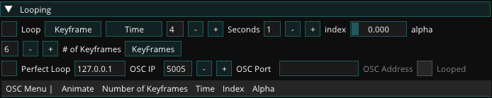

- \# of Keyframes: The number of keyframes used to generate the loop. The more keyframes, the more accurate the loop will be.
- Keyframes: This popup window controls the keyframes used to generate the loop. You can add keyframes by clicking the keyframe button which opens a popup.  
  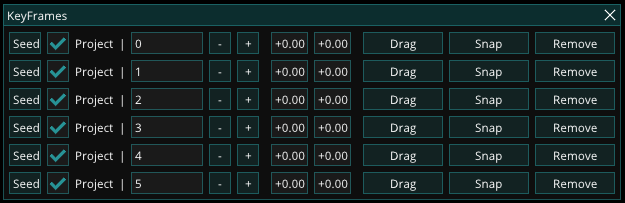
- Time: Controls the duration of the loops in seconds.
- Index: Controls the keyframe number in the loop.
- Alpha: A value between 0 and 1 that corresponds to the whole length of the loop.

### NoiseLoop Looping

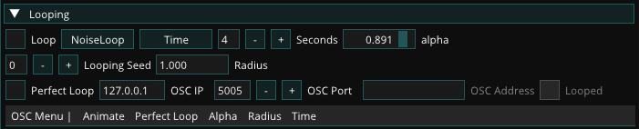

- Time: Controls the duration of the loops in seconds.
- Looping Seed: Changes the start point of the loop.
- Radius: Controls how “large” the latent loop is. Larger values correspond to more diverse changes during the loop.
- Alpha: A value between 0 and 1 that corresponds to the whole length of the loop.

### Perfect Loop

The Perfect Loop option at the bottom of both looping options can help capture the perfect loop. Checking the box will send a 1 signal at the end of each loop cycle through OSC with the OSC IP, port, and address that you can specify.

## Performance and OSC

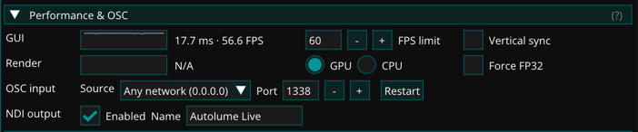

This widget shows the Perform screen’s performance and gathers its input/output settings: the OSC server that receives control signals and the NDI stream that sends the visuals out.

The GUI and Render rows show the frame time and frame rate of the interface and of the image generation respectively.

- FPS limit: Caps the frame rate of the interface, which also limits how often new images are generated.
- Vertical sync: Synchronizes the interface with the display refresh rate.
- GPU/CPU: Selects the device used for image generation. Running on CPU still allows you to perform in real time, but significantly reduces the frame rate of image generation (to around 1 fps, depending on your specific CPU).
- Force FP32: Forces full 32-bit precision in the model. This can fix visual artifacts on some GPUs at the cost of performance.
- OSC input: The source and port on which Autolume listens for incoming OSC signals. The default source, Any network, receives from other devices such as phones and controllers. This machine receives only from apps running on this computer. The source list also shows the addresses of your computer on each network it is connected to. Use one of them as the destination in the app sending the OSC signals. Changing the source applies immediately. For the port, press Restart (or Enter) to apply. See [OSC](#osc) for how to control parameters.
- NDI output: When Enabled, the visuals are streamed over the NDI protocol and can be received in other software such as OBS, Resolume, or TouchDesigner. Name sets the name under which the stream appears on the network. Disabling it saves a bit of processing time per frame.

## Feature Mixer

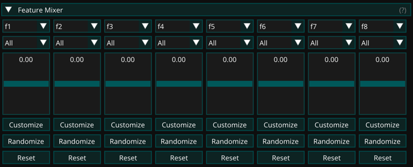

This widget moves the latent vector along up to eight directions at once, each controlled by its own slider.

The first time you load a model, Autolume automatically extracts a bank of 64 meaningful directions for it using the [GANSpace](https://github.com/harskish/ganspace) method. The sliders are disabled while this runs and a progress bar is shown in the header. It happens once per model. The bank is stored in the features folder of your [data folder](index.md#where-autolume-stores-your-data) and loads instantly whenever you open that model again. If extraction fails or is cancelled, the sliders fall back to random directions and a Retry button appears.

Each of the eight slots combines a direction, a zone, and a slider:

- Direction: Picks what the slot controls. f1 to f64 are the extracted directions, ordered from strongest to most subtle. Pick random to give the slot a random direction instead. The same direction can be used in several slots.
- Zone: Applies the direction to a part of the model. Form changes pose and geometry. Texture changes structure and materials. Color changes lighting and palette. All applies the direction everywhere. The same direction on different zones gives genuinely different controls. The zone always names the layers the slot uses. It reads Custom when the layers are hand picked and match no preset.
- Customize: Opens a grid of the model's layers, grouped by resolution, to hand pick exactly where the direction applies. It starts from the current zone's layers. The checkbox in front of each row selects a whole resolution, and None and All clear or select everything. The zone follows the selection. Picking exactly the layers of a preset shows that preset, anything else shows Custom.
- Slider: Moves the image along the direction. Sliders are scaled to each direction's natural strength, so every slot responds consistently.
- Randomize: Replaces the slot's direction with a new random one. Press repeatedly to explore.
- Reset: Restores the slot's extracted direction and returns the slider to zero.
- Use OSC: Lets the slider be driven through OSC with an address and a mapping. See [OSC](#osc).

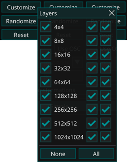

## Layer Transformations

Under the hood the generative model has layers. Each layer performs operations on different resolutions. With this widget, you can control the different layers. This allows you to create a wide range of effects.

You can either do so per resolution in the Simple mode:

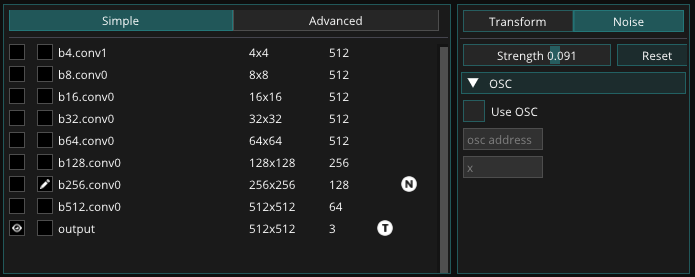

Or per layer in the Advanced mode:

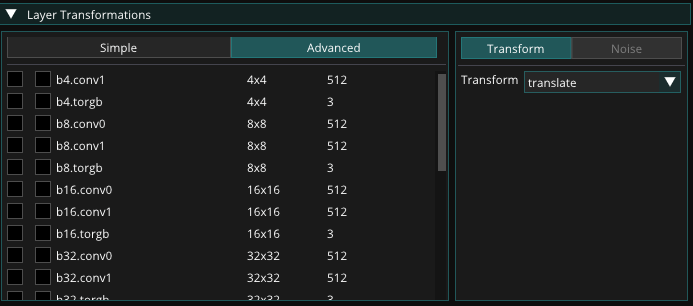

To select which layer you want to manipulate you press the second checkbox, with the pen at the respective resolution or layer. And instead of only showing the final image you can also display the different layers output by clicking the checkbox with the eye.

Per layer, you can either perform a transformation on the image or specify the strength of the noise. Which layers are actively manipulated is visible by the T and N icons. Some layers do not have any adjustable Noise, hence the noise tab is grayed out for those layers.

### Transformation

You can apply so-called affine transformations to the layers, such as rotation, scaling, and translation, These can be performed to all features, a random amount or a set range.

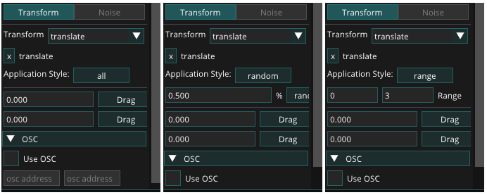

Each transformation's parameter can be controlled by an appropriate interface or by OSC.

### Noise

You can regulate the strength of the noise per layer.

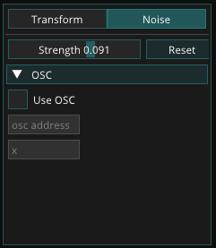

## Model Mixing (real-time)

This widget allows you to perform model mixing like the [Model Mixing](tools.md#model-mixing) tool. When you switch layers a short latency might arise.

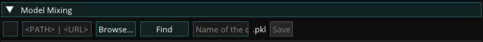

The first checkbox allows you to toggle if the mixed model should be used or not.

Following you can select a model with the "Browse" button, which opens a file browser, or with the "Models" button, which lists the models in your "models" folder and the snapshots of your training runs. You can also type or paste a path into the field and press Enter.

Lastly, you can write a model name into the text field following the buttons. This allows you to quickly save the mixed model into the "models" folder.

After loading a second model you can mix the two models.

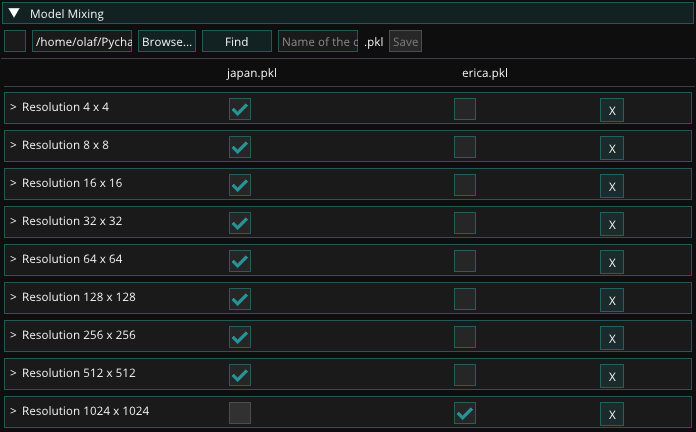

When mixing, you can choose to select features based on resolution or by layer. The latter option provides finer control, but the former option usually suffices. You can also remove features by pressing "X." This can be useful when one of the models generates images of higher resolution, and you want to align the resolution with the lower-resolution model.

## Presets

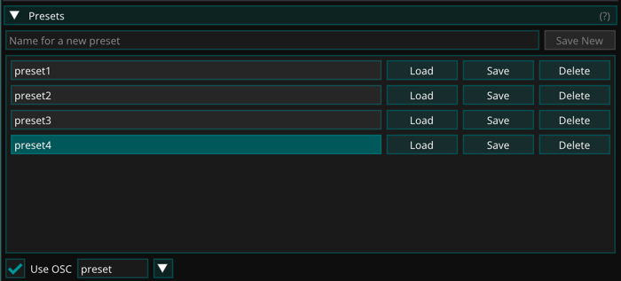

It is possible to save presets of the current state of all widgets and load them again. This allows you to quickly switch between different settings.

To create a preset, type a name in the field at the top and press "Save New" or Enter. Presets are stored in the "presets" folder of your data folder and listed alphabetically.

Each preset in the list can be loaded or overwritten with a single click using its "Load" and "Save" buttons. The preset you loaded last is highlighted. To rename a preset, edit its name in the list and press Enter. "Delete" removes a preset after a confirmation.

The OSC controls of this widget allow you to switch between presets by sending the name of the preset to the configured address, "/preset" by default.

## Audio Module

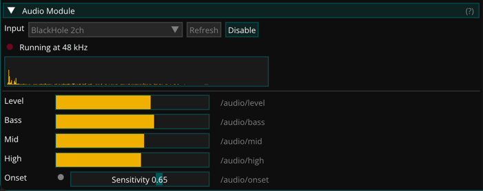

The Audio Module turns live audio into control signals for your performance.

Pick an input device from the dropdown and press Enable. While the module is running it analyzes the incoming audio and publishes five values, updated every frame:

| Address | Meaning |
| --- | --- |
| `/audio/level` | Overall loudness |
| `/audio/bass` | Low frequency energy |
| `/audio/mid` | Mid frequency energy |
| `/audio/high` | High frequency energy |
| `/audio/onset` | Fires on percussive hits |

All values range from 0 to 1 and adapt automatically to the input level.

`/audio/onset` reacts to transients such as drum hits. Use the **Onset sensitivity** slider to tune how easily it fires. Lower it if onset triggers too often on busy music, raise it if it misses hits you want. Setting it to zero turns onset off.

To map a value, open the OSC menu of any widget, enable OSC for a parameter and pick the audio address from the dropdown. The addresses appear in every OSC address picker while the module is running. For example, map `/audio/bass` to the speed of a loop to make motion follow the music.

If a device is plugged in after Autolume starts, press Refresh to rescan.

### Capturing computer audio

The input list shows any virtual audio device, so you can capture system audio by installing a loopback driver such as [BlackHole](https://existential.audio/blackhole/) (macOS).

On macOS, route sound to BlackHole while keeping your speakers active:

1. Open **Audio MIDI Setup** (found in /Applications/Utilities/).
2. Click **+** at the bottom left and choose **Create Multi-Output Device**.
3. Check both your speakers and **BlackHole** in the device list.
4. Open **System Settings → Sound** and set the Multi-Output Device as the output.
5. In Autolume, pick **BlackHole** from the Audio Module input dropdown and press Enable.

macOS treats BlackHole as a microphone input, so the app needs Microphone permission. When running from source, the terminal that launched Autolume must have that permission. If permission is denied, macOS delivers silence rather than an error. So if the meters stay flat after enabling, check **System Settings → Privacy & Security → Microphone**.

## OSC

Autolume allows users to control parameters using its interface but also provides the option to control parameters using [OSC](https://www.google.com/url?q=https://ccrma.stanford.edu/groups/osc/index.html&sa=D&source=editors&ust=1769724592307780&usg=AOvVaw0M9rZhdAGtobHhNvfkNj2x). This allows you to control parameters in Autolume using other software, such as TouchDesigner, Max/MSP, or Processing. The OSC interface is available for all parameters on the Perform screen. Most widgets have an OSC menu similar to the following:

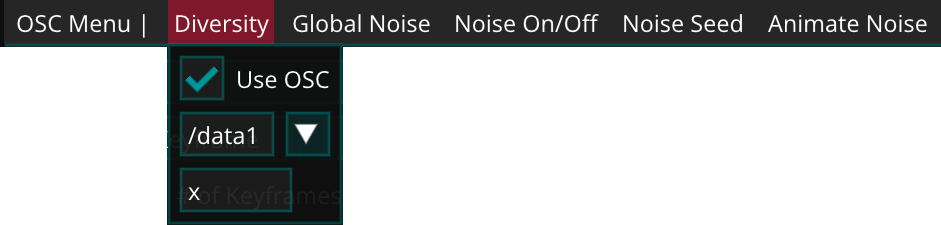

It displays the different parameters that can be controlled using OSC. By clicking on a parameter name, a popup opens which allows you to check the box Use OSC to activate the OSC control for that parameter. In the next field, you can provide the OSC channel name. The arrow button next to it lists the addresses currently being received by the OSC server, so you can pick one instead of typing it. The last field is a mapping function that can be used to perform post-processing on the control signal to make sure that the right data range is used. This follows the math format defined by Python.

By default Autolume listens on all networks, so apps on your phone or another computer can send OSC to it directly. Please see [Performance and OSC](#performance-and-osc) about how to find the address and port to use in the software that sends the OSC signals.
