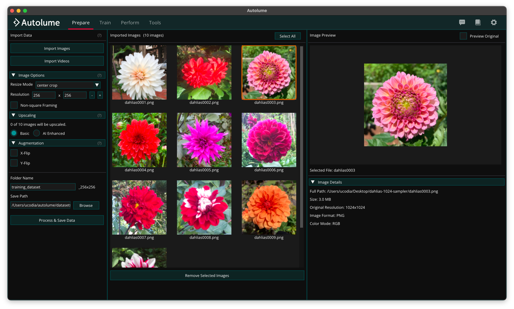

# Prepare

The Prepare screen is where datasets are created prior to model training. It supports importing image and video files and formatting data into the consistent structure required for training. When a video file is imported, frames are automatically extracted based on the specified frame rate, converting motion footage into a sequence of still images suitable for training.

The screen offers fine control over dataset creation: options such as non-square framing to preserve image aspect ratios, image augmentations to expand dataset size and diversity, and integrated tools for managing and organizing data directly within the application. Data can be imported, refined, and compiled entirely in-app. A built-in preview panel displays preprocessing results in real time, allowing visual verification of all applied changes before processing and saving.

## Supported File Formats

The Prepare screen supports importing both image and video files. The following formats are supported:

Image formats:

- PNG (.png)
- JPEG (.jpg, .jpeg)
- BMP (.bmp)
- WebP (.webp)
- GIF (.gif)

Video formats:

- MP4 (.mp4)
- AVI (.avi)
- MOV (.mov)
- MKV (.mkv)
- WebM (.webm)
- GIF (.gif)

## Data Preparation Process

To prepare a dataset, provide the following:

- Resize Mode: Determines how images are resized during preprocessing. Options include stretch and center-crop.
- Resolution: Sets the target pixel dimensions (width × height) for all processed images using the + and – controls. Higher resolutions produce sharper outputs but require more GPU memory during training. It is recommended to test system limits before finalizing this setting.
- Folder Name: Defines the name of the output directory for the processed dataset. By default, the system appends a resolution suffix (e.g., dataset_1024x1024) to the folder name to indicate the dataset’s resolution size.
- Directory Path: Specifies the destination path where the processed dataset folder will be created.
- Non-square Framing: Enables image resizing while maintaining the original aspect ratio instead of forcing a square crop.
  - Aspect Ratio (Height & Width): Sets custom height and width proportions for non-square datasets.
  - Padding Mode: Determines how empty areas are filled when adjusting aspect ratios.
- Augmentation: Applies augmentation techniques to the imported images during processing. These transformations are used to increase dataset size. It is important to select augmentation options carefully based on the nature of the data; for example, if the dataset contains orientation-sensitive subjects such as human faces, flip operations should be adjusted accordingly. The X-Flip and Y-Flip options permanently write flipped copies of each image to disk (enabling both produces all four flip orientations). Do not combine them with the Mirror option on the [Train](train/index.md) screen, which flips images in memory during training: flipping already-flipped images adds no new samples and only wastes storage and compute. If you enable flips here, keep Mirror set to None during training.

Once a dataset is prepared, head to the [Train](train/index.md) screen to train a model on it.
