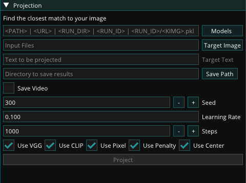
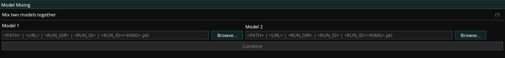
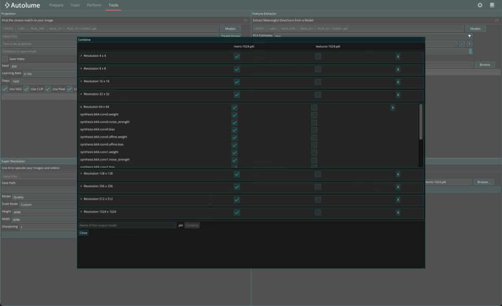

# Tools

The Tools screen gathers two utilities in a single grid: [Projection](#projection) and [Model Mixing](#model-mixing).

## Projection

The Projection tool allows loading a target image, a text prompt, or a combination of both, to find the closest corresponding latent vector of a trained model. Different methods are provided to search for the corresponding latent vector that you can choose from. The output is the calculated vector plus a process video showing the search process.

The following options are available for projection:

- Models: Select the .pkl file of the model used for projection.
- Target Image: Choose a single image that should be found in the model.
- Target Text: Provide a description of an image that should be found in the model.
- Save Path: Specify the path where the closest match should be saved. The saved result includes the position in the model and the closest match.
- Save Video: Select this option to save a video of the process of finding the closest match.
- Seed: Select a seed to ensure consistent results for the closest match.
- Learning Rate: Adjust the learning rate of the projection to control convergence speed. Higher values result in faster projections but may be less accurate.
- Steps: Determine the number of steps for the projection. Higher values increase accuracy but require more time.
- Use VGG: Enable this option to use the VGG16 network for calculating image distance based on general features rather than pixel-by-pixel comparisons.
- Use CLIP: Enable this option to use the CLIP network for calculating image and text distance based on general features rather than pixel-by-pixel comparisons.
- Use Pixel: Enable this option to use pixel distance for image comparison. This puts more weight on pixel similarity between the match and the target.
- Use Penalty: Enable this option to penalize large update steps, resulting in a smoother projection and avoiding local minimums.
- Use Center: Enable this option to use an additional center crop as the target image. This can improve matching accuracy but may reduce overall accuracy.

## Model Mixing

This tool provides the ability to mix two trained models to make a new model. It works based on selecting parts of one model and parts of a different model, thereby mixing the features of the two models.

To mix two models, specify the following:

- Model 1: Select the .pkl file of the first model to be mixed.
- Model 2: Select the .pkl file of the second model to be mixed.

After pressing "Combine," you can select the layers to be used from each model. The layers are listed in order, from early to late layers. While lower-resolution layers (e.g. 4x4, 8x8, 16x16) correspond to coarse and higher-level features, higher-resolution layers correspond to fine features and textures. This can be used to determine what type of features the mixed model inherits from each source. Each layer can also be expanded to select detailed components for advanced mixing. Additionally, features can be removed from the mix. This can be useful when one of the models generates images of higher resolution, and you want to align the resolution with the lower-resolution model.

Finally, you have the option to save the mixed model as a new .pkl file, which can be used anywhere in Autolume.

For real-time model mixing on the Perform screen, see [Model Mixing (real-time)](perform.md#model-mixing-real-time).
