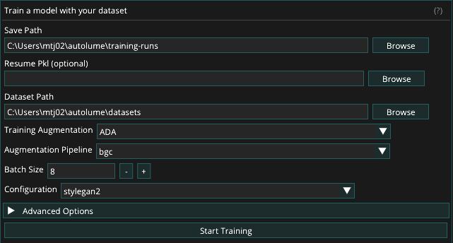

# Train

The Train screen enables users to train models using datasets created on the [Prepare](../prepare.md) screen. It supports both training from scratch and resuming from existing checkpoints. It also leverages data augmentation during training to improve model stability and performance, particularly when working with smaller or less diverse datasets. Throughout the training process, checkpoints and image outputs are automatically generated to document progress and model development.

The screen is split in two panes: training settings on the left, and live training output — status messages and the latest grid of generated sample images — on the right.

## Dataset

The dataset size can range from fewer than a hundred to several thousand samples. A minimum of 50–200 samples is recommended, depending on the diversity and variability of the data. For optimal results, all images within a dataset must have the same dimensions, as a consistent image size is required for model training. Resizing can be performed manually or handled automatically within Autolume on the [Prepare](../prepare.md) screen.

## Training Augmentation

To facilitate training with smaller datasets, two augmentation methods are provided in Autolume: Adaptive Discriminator Augmentation (ADA) and Differentiable Augmentation for Data-Efficient GAN Training (DiffAug). These augmentation methods apply visual transformations to your data during training without modifying your original dataset to help the model continue learning effectively, even when limited data is available. Each method offers a set of pipelines, which are simply different combinations of these transformations applied dynamically during training.

While both methods serve the same purpose, they differ in how they apply these transformations. DiffAug uses fixed-strength, randomized augmentations in every training batch, introducing consistent variation. In contrast, ADA adjusts the strength of augmentations automatically based on how well the model is learning. It's recommended to experiment with both methods and their pipelines to find what works best for your dataset.

If training performance remains poor even after experimenting with augmentation methods and pipelines, consider increasing the size and diversity of your dataset. Additional data can significantly improve model stability and output quality. You may also use the [Prepare](../prepare.md) screen’s augmentation features to expand your dataset before training.

For a detailed guide on choosing the right augmentation method and pipeline, refer to this document: [How to Select Augmentation Method and Pipeline](training-aug.md)

For more technical details, please refer to:  
ADA: [https://github.com/NVlabs/stylegan2-ada-pytorch](https://www.google.com/url?q=https://github.com/NVlabs/stylegan2-ada-pytorch&sa=D&source=editors&ust=1769724592275861&usg=AOvVaw19KrbXZXtytksKuFDBKJa5)  
DiffAug: [https://github.com/mit-han-lab/data-efficient-gans](https://www.google.com/url?q=https://github.com/mit-han-lab/data-efficient-gans&sa=D&source=editors&ust=1769724592276125&usg=AOvVaw2Snhq4HaRpOS1Nc915Txjl)

## Training Process

To train a model, provide the following:

- Save Path: Choose the location where the training files will be saved.
- Dataset: Select the dataset on which the model will be trained. (See [Dataset](#dataset))
- Resume Pkl: Resume training from a previous training run or a pre-trained model by selecting a .pkl file. Skip this field if you are training the model from scratch.
- Training Augmentation: Select the style of augmentation to be applied during training. Experiment with different styles to find the one that works best for your data. (See [Training Augmentation](#training-augmentation))
- Augmentation Pipeline: Choose the types of augmentation to be performed. (See [Choosing Augmentation Pipeline](training-aug.md))
- Batch Size: Determine the number of images processed at once. This value is limited by the GPU memory available. A batch size of 8 is recommended for NVIDIA RTX 2070 GPU and above. Reduce to lower values (minimum 2) if memory issues arise.
- Configuration: Selects from a set of preset training configurations that serve as reliable starting points for different model resolutions. For example, the paper256 configuration is recommended when training models at 256×256 resolution. Refer to the Training New Networks section of [this link](https://www.google.com/url?q=https://github.com/NVlabs/stylegan2-ada-pytorch&sa=D&source=editors&ust=1769724592279946&usg=AOvVaw2lzyqjjDrZbdBs8gHhrKX4) for more details on the available configurations.

Advanced Options:

- Generator and Discriminator Learning Rates: Keeping the default value (0.002) is recommended for most cases. If changing all other hyperparameters does not lead to successful training, you can lower these values to 0.001.
- Gamma: Experiment with different gamma values if the default value (10) is not leading to successful training results. We recommend trying out at least a few different values of Gamma for each new dataset. Using increments of 10 is recommended.
- Number of ticks between snapshots: Specifies how often image snapshots and checkpoint files are generated during training. Each tick represents a defined training interval. Lower values produce snapshots more frequently, allowing closer monitoring of progress, but the visual changes between snapshots will be smaller. A setting between 1 and 4 is generally recommended for balanced tracking and performance.

After selecting the desired options, click the Start Training button to begin the training process. During training, the model periodically saves checkpoint (.pkl) files to the specified Save Path. The output pane on the right displays a grid of randomly generated images from the model, corresponding to the latest image snapshot files saved in the fakesXXXXXX format (e.g., fakes000352) in the same directory.

While a run is active, the training settings become read-only and navigation is locked to the Train screen. Training can be stopped at any time by clicking the Stop Training button. The final model is saved as a .pkl file in the specified Save Path, and progress can be tracked through the series of generated image snapshots.

## Additional Resources

Please refer to these resources for more advanced discussions about hyperparameters for training.

[StyleGan Deep Dive](https://www.google.com/url?q=https://medium.com/@jules.padova/stylegan-deep-dive-from-its-architecture-to-how-to-make-synthetic-humans-e02c242a8b7d&sa=D&source=editors&ust=1769724592284434&usg=AOvVaw0FRJqPuzAS_TpFk0f-QqAN) 

Jules Padova

[Training configurations](https://www.google.com/url?q=https://github.com/NVlabs/stylegan3/blob/main/docs/configs.md%23training-configurations&sa=D&source=editors&ust=1769724592284799&usg=AOvVaw2ubjFQf_4b4gW-dlPtw8lh) 

Tero Karras & Janne Hellsten (NVIDIA Research)

## Alternative Training Options

While Autolume provides the necessary features for network training on a local machine, for more serious training sessions, users can use cloud-based alternative options to train a StyleGAN2 model on more powerful GPUs. The trained model (either using Tensorflow or PyTorch) can then be used in Autolume for real-time use or in other screens. A number of alternative options are as follows:

- Google Colab (simple, both free and paid options) 
   - [Colab notebook 1](https://www.google.com/url?q=https://colab.research.google.com/github/dvschultz/stylegan2-ada-pytorch/blob/main/SG2_ADA_PyTorch.ipynb&sa=D&source=editors&ust=1769724592286379&usg=AOvVaw06oiCjt41W8dzxXMYqWsaE)
  - [Colab notebook 2](https://www.google.com/url?q=https://colab.research.google.com/drive/1BBUxv6QO2hY4lTkCpeAPvSn7H50nTLSi?usp%3Dsharing%23scrollTo%3DNVTn49qEhR1L&sa=D&source=editors&ust=1769724592286630&usg=AOvVaw0pz4u0l394XyARv_kz5p6q)
- Paperspace (advanced, paid)
  - [How to Run StyleGAN2-ADA-PyTorch on Paperspace](https://www.google.com/url?q=https://blog.paperspace.com/how-to-set-up-stylegan2-ada-pytorch-on-paperspace/&sa=D&source=editors&ust=1769724592287066&usg=AOvVaw3u0tnlEOPRoepCoNOKbIck)
