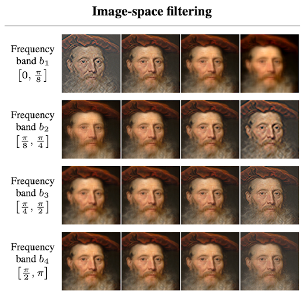

# Training Augmentation

## DiffAug and ADA

DiffAug and ADA are image augmentation strategies applied during training to help the model learn effectively when trained on a smaller or limited dataset. By introducing controlled variations to the training images, these methods allow the model to learn more robustly from smaller datasets. Each method uses its augmentation pipeline, applying techniques such as flipping, colour shifts, or geometric changes to improve training outcomes.

It's important to note that these augmentations are not applied directly to your dataset files. Instead, they act like a lens during training. When the model "sees" your images, it sees an augmented version based on the chosen pipeline. Your original data remains unchanged.

## Choosing Augmentation Method

Choosing between DiffAug and ADA primarily depends on two factors: the size of your dataset and the training goal. It's important to consider both before beginning the training process.

| Criteria | DiffAug | ADA |
| --- | --- | --- |
| Dataset Size | Small to medium dataset (fewer than 10k images) | Works well with all sizes |
| Training Speed | Faster | Slower |
| Variation | Creates more visual variation in the final model | More consistent visuals compared to the dataset |
| Best For | Quick experiments, smaller datasets, and cases where variety is welcome | Long, stable training sessions with a focus on dependable model output quality |

## Choosing Augmentation Pipeline

A general rule of thumb, the more data you have, the fewer augmentation techniques you need, which also means faster training. The pipeline refers to the combination of augmentation techniques applied during training to help the model learn better. Choosing the right pipeline would depend on your dataset.

### DiffAug Pipeline

When choosing a pipeline for DiffAug, consider how much variation your dataset can realistically tolerate. Since DiffAug applies augmentations on each training batch, it introduces more visual variety, which can help the model generalize better, but it can also shift the dataset from its original form. Below are quick guidelines to help you choose the right components:

- **Colour**
  - Ideal for datasets captured under various lighting conditions or environments.
  - Avoid if your dataset is colour-sensitive, like artwork where colour accuracy matters.
- **Translation**
  - Useful when the subject appears in different positions across the dataset.
  - Avoid if spatial consistency is important (e.g., faces or aligned subjects)
- **Cutout**
  - Helps the model learn to focus on different parts of the image by masking random regions.
  - Avoid if your dataset is very small or if the subject takes up only a small part of the image, as critical details might be lost.

### ADA Pipeline

When choosing an ADA pipeline, the most important factor is your dataset size. Each augmentation technique has different benefits depending on how much data you're working with. A good starting point for most cases is the default 'bgc' pipeline. As a general rule, the more data you have, the less augmentation you need. For datasets with 10k images or fewer, 'bgc' helps maintain stability during training. When your dataset exceeds 100k images, it's often best to simplify the pipeline by using only 'bg', or even disabling augmentations altogether (to be implemented). Ultimately, every dataset behaves differently, so it's always best to experiment and adjust based on your training results.

Below is a breakdown of each augmentation component used in ADA pipelines:

- **Blit (b)**: Flips image to left/right, 90° interval rotations, and translation.
- **Geometric (g)**: Zooms the image in/out, rotates the image (up to 360°), and stretches or squishes the image.
- **Colour (c)**: Perform brightness, contrast, and colour tone, and saturation changes to simulate different lighting.
- **Filter (f)**: Sharpens or blurs the image by adjusting textures.
- **Noise (n)**: Adds noise to the image.
- **Cutout (c)**: Covers a random part of the image using a patch.

> **Note**: The pipeline is defined using combinations of these letters. For example, 'bgcfnc' includes Blit, Geometric, Colour, Filter, Noise, and Cutout augmentations.

## Diving Deeper: Technical Breakdown of Augmentation Methods

Both DiffAug and ADA perform augmentations during training to help models generalize better. This is especially useful when working with smaller datasets or with unbalanced ones where certain visual styles are underrepresented. However, the two methods operate in fundamentally different ways. DiffAug applies constant augmentations per batch, introducing consistent randomness throughout training, which can lead to greater diversity in generated outputs. In contrast, ADA augments data based on the discriminator's confidence, adaptively increasing or decreasing augmentation strength over time to maintain training stability. This difference in augmentation strategy not only affects the training dynamics but also the visual consistency and convergence behavior of the final model.

### Difference between DiffAug and ADA

| Category | DiffAug | ADA |
| --- | --- | --- |
| Purpose | Applies fixed, differentiable augmentations to each batch of real and fake images | Dynamically adjusts augmentation strength to prevent discriminator overfitting during training |
| Applies To | Both real and fake images. | Both real and fake images. |
| Augmentation Strength | Fixed strength with randomized augmentations applied uniformly across training | Adaptive strength which adjusts in response to the discriminator's performance during training |
| Augmentation Types | • Colour (brightness, saturation, contrast) • Translation (X, Y shift) • Cutout (random masking) | • Blit (pixel shifts, flips, 90° rotations) • Geometric (zoom, rotate, stretch) • Colour • Filter (blur/sharpen) • Noise • Cutout |

Unlike DiffAug, which applies fixed augmentations to every batch from the start of training, ADA adjusts augmentation strength dynamically over time. It begins with an augmentation probability $p = 0$, allowing the discriminator to initially learn from unaltered real and generated images. As training progresses and the discriminator becomes increasingly confident, risking overfitting, ADA gradually increases $p$, making augmentations stronger to regularize the training. This adaptive mechanism helps prolong stable training by preventing the discriminator from memorizing the dataset. However, if $p$ becomes too high, the augmentations can start to degrade the quality of training. Therefore, it's important to experiment with the generated .pkl checkpoints along the way to find the best model output for your needs.

For more technical details, please refer to:

- **DiffAug**: [https://arxiv.org/pdf/2006.10738](https://arxiv.org/pdf/2006.10738)
- **ADA**: [https://nvlabs-fi-cdn.nvidia.com/stylegan2-ada-pytorch/ada-paper.pdf](https://nvlabs-fi-cdn.nvidia.com/stylegan2-ada-pytorch/ada-paper.pdf)

## Augmentation Examples

### DiffAUG Transformation Previews

- Colour 

    

    Colour transformations adjust brightness, saturation, and contrast to simulate different lighting conditions.

- Translation

    

    Translation shifts the image along the X and Y axes. Useful when subjects appear in different positions.

- Cutout

    

    Cutout masks random regions of the image, helping the model learn to focus on different parts of the image.

### ADA Transformation Previews

- Blit (b)

    

    Pixel blitting includes flips, 90° interval rotations, and translation operations.

- Geometric (g)

    

    General geometric transformations include zoom, rotation (up to 360°), and stretching/squishing.

- Colour (c)

    

    Colour transformations simulate different lighting through brightness, contrast, and saturation changes.

- Filter (f)

    

    Image-space filtering includes sharpening and blurring operations to adjust textures.

- Noise (n) & Cutout (c)

    

    Image-space corruptions include adding noise and masking random regions with patches.
