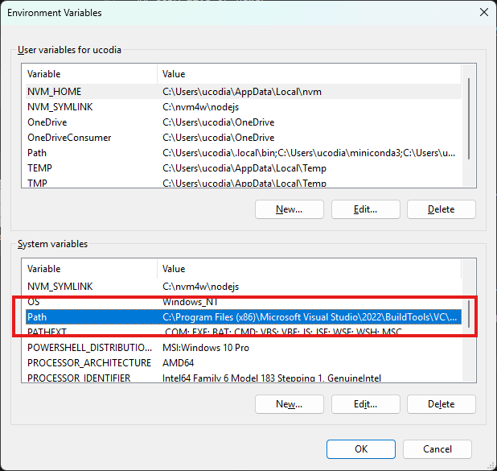

# Windows Requirements

Windows users need to have both Microsoft C++ Build Tools and CUDA 12.8+ Development and Runtime libraries installed and properly configured for optimal performance. Failure to do so can **slow down training performance by ~250%** (3.5x slower).

## Visual Studio 2022 C++ Build Tools

[Download link](https://download.visualstudio.microsoft.com/download/pr/13907dbe-8bb3-4cfe-b0ae-147e70f8b2f3/a3193e6e6135ef7f598d6a9e429b010d77260dba33dddbee343a47494b5335a3/vs_BuildTools.exe)

Minimum components:

 - Desktop development with C++

## CUDA 12.8 or newer

([Download link](https://developer.nvidia.com/cuda-12-8-0-download-archive))

Minimum components:

- CUDA Development
- CUDA Runtime

## Environment variables

While CUDA should automatically be added to your system environment variables, you will still need to install the Microsoft C++ Build Tools variables manually.

- In the Windows start menu, type "environment" and click "Edit the system environment variables", then click on the "Environment Variables..." button.

- In the "System variables" section, find the `Path` variable and double click on it

- Finally add a new line with value `C:\Program Files (x86)\Microsoft Visual Studio\2022\BuildTools\VC\Tools\MSVC\14.44.35207\bin\Hostx64\x64`

- (OPTIONAL) If you want to verify that the dependencies are properly configured, in the Windows start menu, type "terminal" and click "Terminal", then first type `where.exe cl.exe` and enter, then `where.exe nvcc.exe` and enter. In both case it should retun the path as configured in the previous step.

