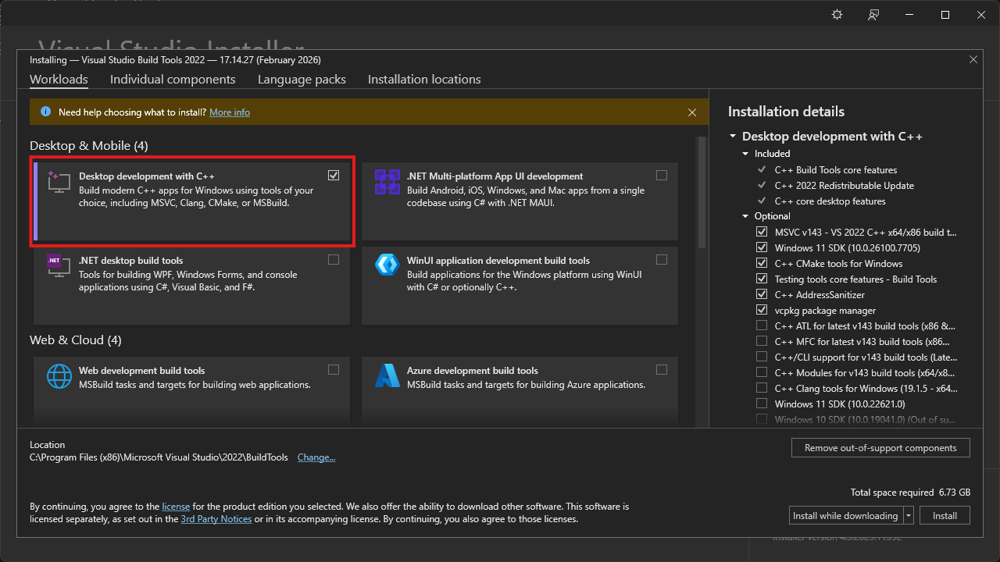
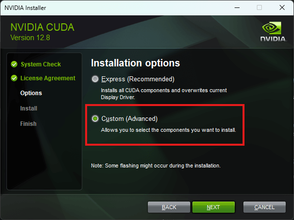
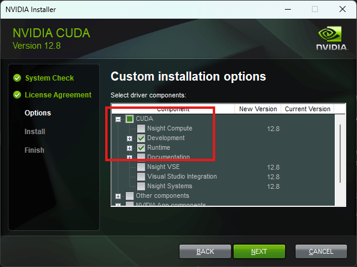

# Windows Requirements

Windows users need to have both Microsoft C++ Build Tools and CUDA 12.8+ Development and Runtime libraries installed and properly configured for optimal performance. Failure to do so can **slow down training performance by ~250%** (3.5x slower).

## Visual Studio 2022 C++ Build Tools

[Download link](https://download.visualstudio.microsoft.com/download/pr/13907dbe-8bb3-4cfe-b0ae-147e70f8b2f3/a3193e6e6135ef7f598d6a9e429b010d77260dba33dddbee343a47494b5335a3/vs_BuildTools.exe)

Minimum components:

 - Desktop development with C++

## CUDA 12.8 or newer

([Download link](https://developer.nvidia.com/cuda-12-8-0-download-archive))

Minimum components:

- CUDA Development
- CUDA Runtime

